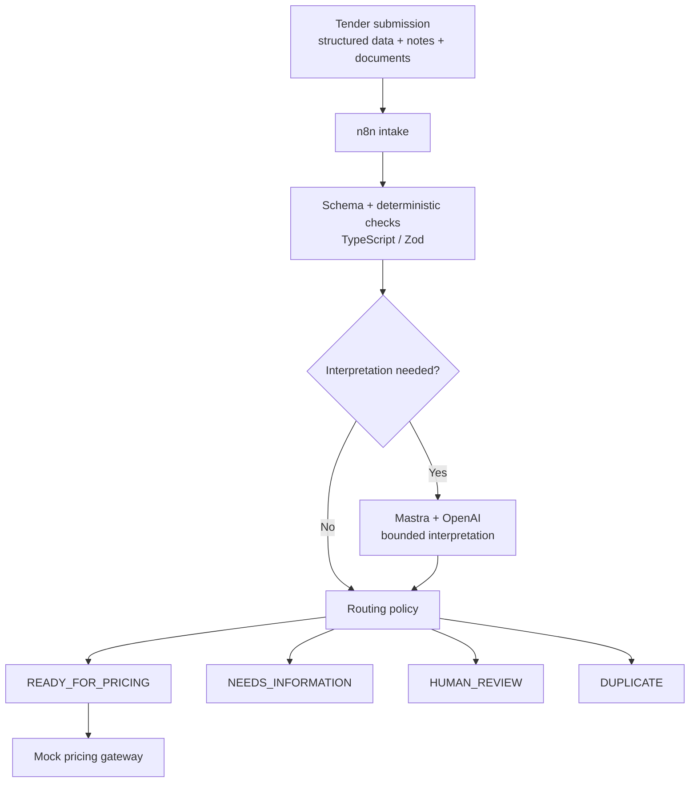

# Tender Readiness Engine

A production-style tender readiness automation for business energy, combining deterministic rules, bounded AI reasoning, human review, evals, and AWS-native infrastructure.

> **Project status:** early implementation. This repository is intentionally being built in public as a reviewable engineering project.

## What it does

The engine evaluates an incoming business-energy tender before it is handed to a downstream pricing system. It combines structured tender data, supporting documents, and unstructured notes, then produces one of four business outcomes:

- `READY_FOR_PRICING` - required information is present, consistent, and safe to hand downstream.
- `NEEDS_INFORMATION` - required information is missing and can be requested clearly.
- `HUMAN_REVIEW` - information is conflicting, ambiguous, or unsafe to resolve automatically.
- `DUPLICATE` - the tender appears to have already been submitted.

Technical execution is tracked separately through `RECEIVED`, `PROCESSING`, `COMPLETED`, and `FAILED` states.

## Design principle

The project is deliberately **deterministic first**:

- TypeScript owns explicit business rules, validation, routing, and safety invariants.
- Mastra + OpenAI are used only where semantic interpretation is genuinely useful.
- Human review is an intentional route for uncertainty and accountable judgment.
- Only `READY_FOR_PRICING` is allowed to cross the downstream pricing boundary.



## Intended stack

- **TypeScript** for the domain layer and application code
- **Zod** for boundary validation
- **Mastra + OpenAI** for bounded reasoning tasks
- **n8n** for integration orchestration
- **AWS S3** for source documents
- **AWS-native persistence/runtime** where practical for V1
- **GitHub Actions** for tests, eval gates, and deployment workflows

The final AWS implementation choices are documented as architecture decisions as the build progresses rather than presented as assumptions about another team's internal stack.

## Evaluation and safety

Model-dependent behaviour is evaluated against labelled synthetic cases. Key metrics include:

- route precision and recall
- `HUMAN_REVIEW` recall
- critical-field extraction accuracy
- **unsafe auto-proceed rate**

The highest-priority failure is a case that should be blocked, reviewed, or returned for more information but is incorrectly classified as `READY_FOR_PRICING`.

The project separates:

1. deterministic automated tests,
2. agent/workflow evals,
3. manual QA.

## Scope and disclaimer

This is an independent engineering project inspired by publicly available information about business-energy tendering and the skills described in tem's Senior Automation Specialist role.

It does **not** claim to reproduce tem's internal tender process, business rules, APIs, data model, pricing interfaces, or Rosso architecture. All companies, brokers, sites, documents, meter information, rules, and tender records used by the prototype are synthetic.

The project deliberately stops at a mocked `READY_FOR_PRICING` handoff. Real pricing and transaction infrastructure are outside scope.

## Documentation

- [Architecture](docs/architecture.md)
- [Discovery and assumptions](docs/assumptions.md)
- [Process map and automation boundary](docs/process-map.md)
- [Business rules and decision policy](docs/business-rules.md)
- [Eval and QA strategy](docs/eval-strategy.md)
- [Implementation plan](docs/implementation-plan.md)
- [Runbook](docs/runbook.md)
- [Architecture decision records](docs/adr/README.md)

## Build approach

The system is being built in vertical slices:

1. repository and domain core
2. local end-to-end tender flow
3. bounded Mastra/OpenAI reasoning
4. eval harness and safety gates
5. operations console
6. AWS persistence/runtime
7. n8n integration
8. reliability, observability, and CI/CD
9. stable public release

The goal is not to maximise feature count. The goal is to make every automated decision understandable, testable, observable, and safe to operate.

## Local development

Requirements: Node.js 22 or later and npm.

```sh
npm ci
npm run check
```

Individual checks are available as `npm run format:check`, `npm run lint`, `npm run typecheck`, and `npm test`. Copy `.env.example` to `.env` when local settings are needed; keep credentials out of tracked files.

The initial workspace layout is:

```text
apps/api/         Local API, introduced in Milestone 2
packages/domain/  Deterministic domain core, introduced in Milestone 1
integrations/     External workflow assets
infra/            Deployment and infrastructure assets
docs/             Architecture, rules, and delivery plan
.github/workflows/CI checks
```

Start the local API with `npm run dev:api`. It listens on `PORT` (default `3000`) and writes synthetic processing state to `TENDER_STATE_PATH` (default `./data/tender-state.json`, ignored by Git). Submit a JSON `ReadinessInput` to `POST /tenders`; a clean tender returns `READY_FOR_PRICING` and records one mock handoff. Repeating the same idempotency key and payload returns the stored outcome. The local JSON repository supports a single API process.

