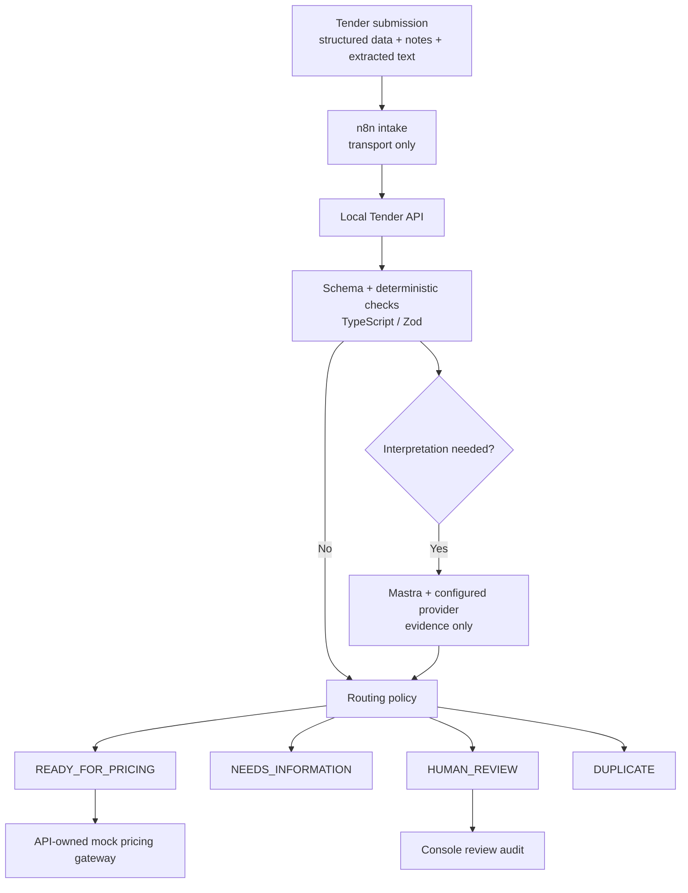

# Tender Readiness Engine

A production-style tender readiness automation for business energy. It combines deterministic TypeScript rules, a bounded evidence-only agent, human review audit, labelled evals, a local operations console, credential-free n8n intake, and a private S3 evidence archive.

> **Project status:** local V1 is tagged `v1.0.0`. Clone the repository, run the demo, and read the retained eval/QA receipts. Hosted runtime, concurrent database, authentication, and real pricing/data remain deferred. Console **Intake pack** (Milestone 10 / [ENG-16](https://linear.app/workwithlayer/issue/ENG-16/console-intake-pack-pdf-notes-extract-review-assess)) is post-V1: contracts and [ADR-005](docs/adr/005-intake-pack-boundary.md) are in the domain package; upload UI and PDF parsing are not implemented.

## What it does

The engine evaluates an incoming business-energy tender before it is handed to a downstream pricing system. It combines structured tender data, supporting document references, and unstructured notes, then produces one of four business outcomes:

- `READY_FOR_PRICING` — required information is present, consistent, and safe to hand downstream.
- `NEEDS_INFORMATION` — required information is missing and can be requested clearly.
- `HUMAN_REVIEW` — information is conflicting, ambiguous, or unsafe to resolve automatically.
- `DUPLICATE` — the tender appears to have already been submitted.

Technical execution is tracked separately through `RECEIVED`, `PROCESSING`, `COMPLETED`, and `FAILED` states.

## Implemented boundaries

These are the current system boundaries, not a future design:

| Concern | Owner | What it does not do |
| --- | --- | --- |
| Deterministic routes | TypeScript domain + API | The model does not choose the final route or fill missing structured fields. |
| Bounded interpretation | Tool-free Mastra agent in `apps/api` | Evidence and citations only. No pricing tools. Provider failure cannot assign a route. |
| Human audit | Loopback review events on the API | A disposition does not change the automatic route or create a pricing handoff. |
| Mock pricing | API-owned gateway | Only a final `READY_FOR_PRICING` route may call it. n8n records the outcome and never initiates pricing. |
| Live runtime | Local API, Console, and Mastra Studio | No hosted application, concurrent database, or production authentication. |
| Evidence archive | Private S3 snapshots | Manual archive/restore outside the decision path. Not the live database. |


```mermaid
flowchart TD
    A["Tender submission<br/>structured data + notes + extracted text"] --> B["n8n intake<br/>transport only"]
    B --> C["Local Tender API"]
    C --> D["Schema + deterministic checks<br/>TypeScript / Zod"]
    D --> E{"Interpretation needed?"}
    D -->|No| F["Routing policy"]
    E -->|Yes| G["Mastra + configured provider<br/>evidence only"]
    G --> F
    F --> H["READY_FOR_PRICING"]
    F --> I["NEEDS_INFORMATION"]
    F --> J["HUMAN_REVIEW"]
    F --> K["DUPLICATE"]
    H --> L["API-owned mock pricing gateway"]
    J --> M["Console review audit"]
```

## Stack

- **TypeScript + Zod** for the domain layer, API contracts, and safety invariants
- **Mastra + an OpenAI-compatible provider** for bounded interpretation of notes and already-extracted document text
- **Next.js console** for queue, case detail, review history, and eval performance
- **n8n 1.112.6** for webhook intake and synthetic outcome receipts
- **Local JSON state** for the single-process demo
- **AWS S3** for private synthetic snapshots, not live state
- **GitHub Actions** for format, lint, typecheck, tests, API/Console builds, and committed reasoning-evidence checks

The live API, Console, and Studio stay local. A hosted runtime can be considered separately if a live URL becomes important; no AWS service choice is a claim about another team's internal stack.

## Evaluation and safety

Model-dependent behaviour is evaluated against 63 labelled synthetic cases. The highest-priority failure is a case that should be blocked, reviewed, or returned for more information but is incorrectly classified as `READY_FOR_PRICING`.

The project separates:

1. deterministic automated tests,
2. agent/workflow evals,
3. manual QA.

**Do not treat the latest passing full report as the accepted baseline.**

| Pointer | Report | What it is |
| --- | --- | --- |
| Accepted baseline | [`evals/accepted-baseline.json`](evals/accepted-baseline.json) → [`full-2026-09-26T23-53-52.654Z`](evals/reports/full-2026-09-26T23-53-52.654Z.md) | Reviewed Milestone 4 prototype reference. 63 cases; 7 gates; workflow facts 49/51; agent facts 51/51. |
| Selected release evidence | [`evals/release-evidence.json`](evals/release-evidence.json) → [`full-2026-10-05T14-22-22.835Z`](evals/reports/full-2026-10-05T14-22-22.835Z.md) | Clean source `9fbf16f`; 63 cases; **passed 9/9 gates**; workflow facts 49/51; agent facts 51/51; 0/44 unsafe-ready. Compared with the accepted baseline; **not promoted**. |
| Latest committed PR evidence | [`evals/pr-evidence.json`](evals/pr-evidence.json) → [`pr-2026-10-04T23-14-16.314Z`](evals/reports/pr-2026-10-04T23-14-16.314Z.md) | 14-case smoke subset. Not a full-release baseline. |

Thresholds in [`evals/thresholds.json`](evals/thresholds.json) are unchanged: 0 unsafe-ready cases, ≥95% `HUMAN_REVIEW` recall, ≥95% critical-fact precision/recall, and no more than a 1 percentage-point safety drop against a comparable accepted baseline. Empty denominators fail the corresponding gate. See [eval strategy](docs/eval-strategy.md) and [eval findings](docs/eval-findings.md).

## Scope and disclaimer

This is an independent engineering project inspired by publicly available information about business-energy tendering and the skills described in tem's Senior Automation Specialist role.

It does **not** claim to reproduce tem's internal tender process, business rules, APIs, data model, pricing interfaces, or Rosso architecture. All companies, brokers, sites, documents, meter information, rules, and tender records used by the prototype are synthetic.

The project deliberately stops at a mocked `READY_FOR_PRICING` handoff. Real pricing and transaction infrastructure are outside scope.

## Verified limitations

These are current, inspected limits — not a backlog slogan:

- Live runtime is one local API process and one local JSON state file. Concurrent writers are unsupported.
- Review mutations are loopback-only. The console uses a demo operator label (`REVIEW_ACTOR` or `local-demo-operator`), not production authentication.
- The agent receives notes and already-extracted document text. It does not download, parse, or register PDFs.
- n8n records synthetic receipts. `NEEDS_INFORMATION` delivery is `NOT_SENT`. No email or chat is sent.
- S3 is a private archive. Restoring copies evidence; it does not reprocess tenders or call pricing. Studio traces stay in a separate local store.
- Hosted API/Console, a concurrent database, GitHub-to-AWS OIDC, real customer/broker data, and real pricing remain deferred.
- Promotional AWS credit balance/expiry is an account-administration follow-up, not an archive-correctness gate.
- A documented cross-site association-check product fix was investigated during ENG-14 and is **not landed**; landing it would invalidate eval SHA `9fbf16f`.
- Live n8n and live private S3 were not re-run on that eval SHA. [ENG-7](docs/milestone-7-verification.md) and [ENG-4](docs/milestone-6-verification.md) remain those receipts.
- The `v1.0.0` git tag exists. Console Intake pack stays Milestone 10 ([ENG-16](https://linear.app/workwithlayer/issue/ENG-16/console-intake-pack-pdf-notes-extract-review-assess)): contracts in [ADR-005](docs/adr/005-intake-pack-boundary.md); PDF upload and parsing are not live.

## Reviewer walkthrough

Follow these commands from a fresh clone. They use synthetic data only.

1. **Install and check**

   ```sh
   npm ci
   npm run check
   ```

   Individual checks: `npm run format:check`, `npm run lint`, `npm run typecheck`, and `npm test`. Copy [`.env.example`](.env.example) to `.env` when local settings are needed; keep credentials out of tracked files.

2. **Run the local API and Console**

   ```sh
   npm run dev:api
   ```

   In a second terminal:

   ```sh
   npm run dev:console
   ```

   Open `http://localhost:3001`. Seed three synthetic cases:

   ```sh
   npm run demo:seed
   ```

   The clean case records one mocked handoff. The missing-information case records one `information-request:{runId}` receipt marked `NOT_SENT`. The conflicting-date case records neither. Authentic Console captures are in [the screenshot set](docs/screenshots/operations-console/README.md).

3. **n8n intake**

   Import the credential-free workflow and run the fixture matrix in [the n8n walkthrough](integrations/n8n/README.md) (ready, missing information, human review, duplicate, pending, and failure). The recorded live-runtime evidence is in the [Milestone 7 receipt](docs/milestone-7-verification.md). Live n8n was not re-run on eval SHA `9fbf16f`.

4. **Archive and restore**

   Prepare a snapshot from seeded local state, then restore it into a fresh directory. Commands are in the [archive/restore runbook](docs/runbook.md#milestone-6-archive-and-restore). Live private-S3 evidence is in the [Milestone 6 receipt](docs/milestone-6-verification.md).

5. **Failure and recovery**

   Visible failure → no unsafe action → safe recovery is recorded in the [reliability rehearsal](docs/reliability-rehearsal.md) and the [runbook](docs/runbook.md#failure-scenarios-rehearsed).

6. **Assess evals**

   Read the accepted baseline and the selected release report linked above. The Console Performance page shows the same distinction. Do not promote the later passing report over `evals/accepted-baseline.json`.

The five interview-demo stories (ready, missing information, human review, duplicate, visible failure and recovery) are summarised with evidence links in [the v1.0.0 notes](docs/releases/v1.0.0.md#demo-coverage).

## Local development

Requirements: Node.js 22 or later and npm. Docker is required only for the recommended n8n import. AWS CLI v2 is required only for private S3 upload/restore.

```sh
npm ci
npm run check
```

Workspace layout:

```text
apps/api/         Local Tender API, bounded Mastra agent, and Studio registration
apps/console/     Local operations console
packages/domain/  Deterministic domain core
integrations/     Credential-free n8n workflow and fixtures
infra/            Private S3 archive notes
docs/             Architecture, rules, runbook, receipts, and ADRs
evals/            Labelled cases, thresholds, reports, and evidence pointers
.github/workflows/CI and release-evidence workflow
```

Start the local API with `npm run dev:api`. It listens on `PORT` (default `3000`, host `127.0.0.1`) and writes synthetic processing state to `TENDER_STATE_PATH` (default `./data/tender-state.json`, ignored by Git). Submit a JSON `ReadinessInput` to `POST /tenders`. A clean structured tender returns `READY_FOR_PRICING` and records one mock handoff. Repeating the same idempotency key and payload returns the stored outcome. The local JSON repository supports a single API process.

Start the operations console in a second terminal with `npm run dev:console`; open `http://localhost:3001`. Queue, tender detail, review history, and eval performance are read through the API. Review dispositions are recorded for synthetic `HUMAN_REVIEW` cases and do not change the automatic route or create a pricing handoff. The console binds to loopback and uses a demo operator identity; it is not production authentication.

Structured-only requests do not call a model. Requests with `textSources` need a configured provider key in `.env`. See the [runbook](docs/runbook.md) for Studio on port `4113`, n8n, archive/restore, and recovery.

## Documentation

- [Architecture](docs/architecture.md)
- [Discovery and assumptions](docs/assumptions.md)
- [Process map and automation boundary](docs/process-map.md)
- [Business rules and decision policy](docs/business-rules.md)
- [Eval and QA strategy](docs/eval-strategy.md)
- [Eval findings](docs/eval-findings.md)
- [Implementation plan](docs/implementation-plan.md)
- [Runbook](docs/runbook.md)
- [Reliability rehearsal](docs/reliability-rehearsal.md)
- [Milestone 6 archive receipt](docs/milestone-6-verification.md)
- [Milestone 7 n8n receipt](docs/milestone-7-verification.md)
- [Operations Console screenshots](docs/screenshots/operations-console/README.md)
- [n8n integration](integrations/README.md)
- [Architecture decision records](docs/adr/README.md)
- [v1.0.0 release notes](docs/releases/v1.0.0.md)
- [ENG-15 secrets and security check](docs/releases/security-check-2026-10-05.md)
- [ENG-14 release QA receipt](docs/release-qa/README.md)
- [Intake pack boundary](docs/adr/005-intake-pack-boundary.md)
