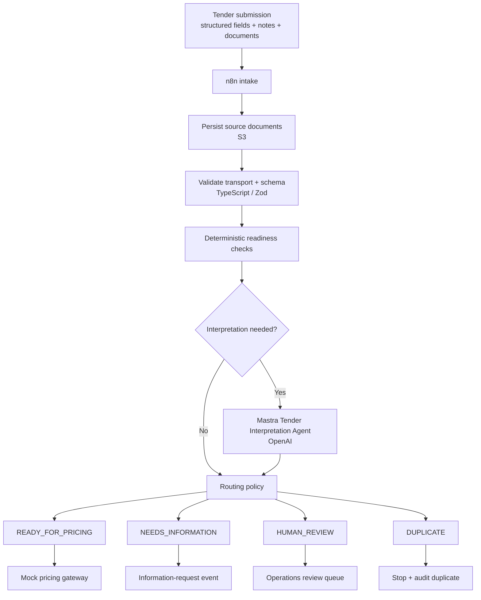

# Architecture

## System intent

The Tender Readiness Engine evaluates whether a synthetic business-energy tender is complete, consistent, and safe to hand to a downstream pricing system.

The architecture separates four concerns deliberately:

1. **integration** - receive events and move data between systems,
2. **domain logic** - validate, apply explicit rules, and choose a route,
3. **reasoning** - interpret ambiguous or unstructured information,
4. **human judgment** - resolve critical uncertainty and accountable decisions.

## High-level flow



## Responsibility boundaries

| Layer | Responsibility | Intended technology |
| --- | --- | --- |
| Integration | Receive events, move files, call APIs, trigger downstream workflows | n8n |
| Domain | Schemas, deterministic rules, routing, state transitions | TypeScript + Zod |
| Reasoning | Interpret unstructured or semantically ambiguous information | Mastra + OpenAI |
| Human judgment | Resolve critical conflicts and accountable exceptions | Ops console |
| Infrastructure | Files, application state, runtime, logs | AWS |
| Pricing boundary | Accept readiness-cleared normalized tenders only | Mock gateway |

## Deterministic-first policy

If a rule can be expressed clearly and tested cheaply, it belongs in code rather than a prompt.

Examples:

- required-field checks
- date parsing and normalization
- numeric bounds
- duplicate detection
- identifier formatting
- routing precedence
- idempotency
- retry policy
- authorization to call the pricing gateway

## AI boundary

OpenAI is used only where semantic interpretation adds value, for example:

- extracting structured facts from free text or text-based documents,
- associating broker notes or documents with the correct site,
- identifying semantic conflict between differently worded sources,
- returning evidence-backed explanations.

The model returns structured evidence. It does not own the final safety policy.

## Human-review boundary

A case routes to `HUMAN_REVIEW` when critical information cannot be resolved safely through deterministic policy, including:

- conflicting critical sources with no explicit source-of-truth rule,
- unresolved site/document association,
- critical extraction uncertainty,
- unsupported or terminally unprocessable evidence,
- explicit accountable approval requirements.

Human review is an intentional route, not a system failure.

## Business route vs processing status

Business routing and technical execution are separate concerns.

**Business routes**

- `READY_FOR_PRICING`
- `NEEDS_INFORMATION`
- `HUMAN_REVIEW`
- `DUPLICATE`

**Processing statuses**

- `RECEIVED`
- `PROCESSING`
- `COMPLETED`
- `FAILED`

A tender can therefore be `COMPLETED` with route `HUMAN_REVIEW`, or remain `READY_FOR_PRICING` while a downstream delivery attempt is technically `FAILED`.

## Key invariants

- A non-ready route must never invoke the pricing gateway.
- Model failure or malformed model output must never become implicit readiness.
- n8n orchestrates integrations but does not become a second business-rule engine.
- Every final route must be reconstructable from stored evidence.
- Replays must not create duplicate downstream actions.
- Human corrections become audit events and candidate regression cases.

## Pricing boundary

The prototype deliberately stops at:

```text
Tender Readiness Engine
        ↓
READY_FOR_PRICING
        ↓
Mock pricing gateway
        ↓
[real pricing / transaction infrastructure is outside scope]
```

The project does not attempt to recreate Rosso or any private pricing interface.
