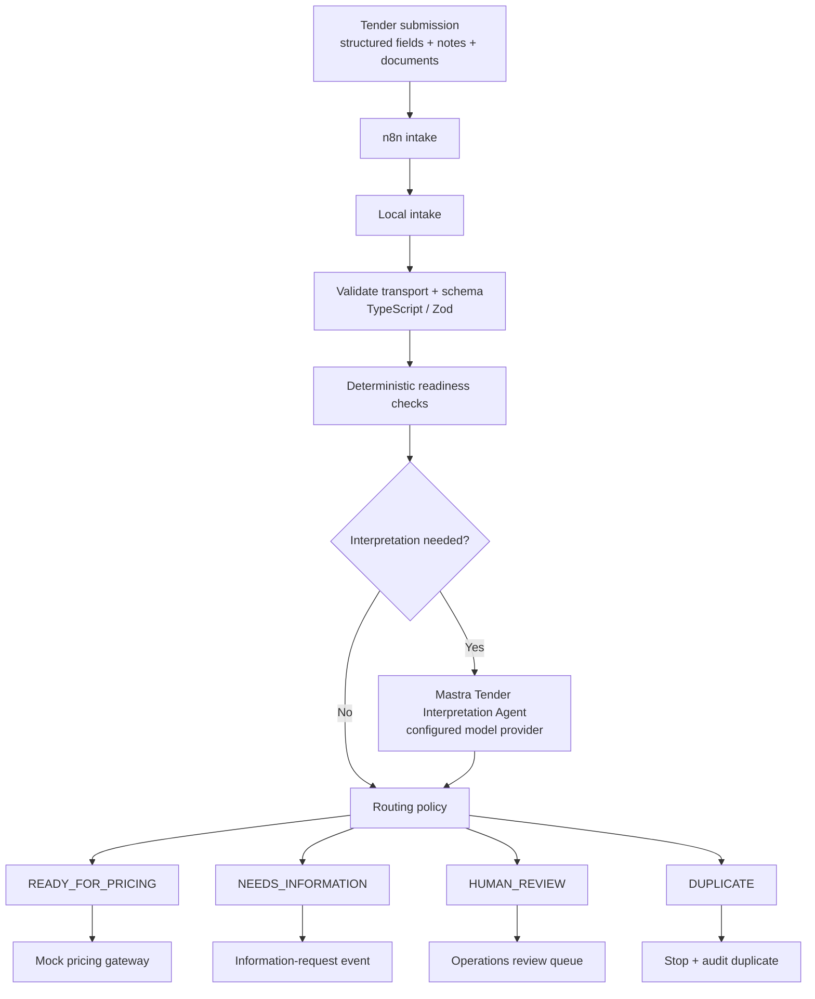

# Architecture

## System intent

The Tender Readiness Engine evaluates whether a synthetic business-energy tender is complete, consistent, and safe to hand to a downstream pricing system.

The architecture separates four concerns deliberately:

1. **integration** - receive events and move data between systems,
2. **domain logic** - validate, apply explicit rules, and choose a route,
3. **reasoning** - interpret ambiguous or unstructured information,
4. **human judgment** - resolve critical uncertainty and accountable decisions.

## High-level flow


```mermaid
flowchart TD
    A["Tender submission<br/>structured fields + notes + documents"] --> B["n8n intake"]
    B --> C["Local intake"]
    C --> D["Validate transport + schema<br/>TypeScript / Zod"]
    D --> E["Deterministic readiness checks"]
    E --> F{"Interpretation needed?"}
    F -->|No| H["Routing policy"]
    F -->|Yes| G["Mastra Tender Interpretation Agent<br/>configured model provider"]
    G --> H
    H --> I["READY_FOR_PRICING"]
    H --> J["NEEDS_INFORMATION"]
    H --> K["HUMAN_REVIEW"]
    H --> L["DUPLICATE"]
    I --> M["Mock pricing gateway"]
    J --> N["Information-request event"]
    K --> O["Operations review queue"]
    L --> P["Stop + audit duplicate"]
```

## Responsibility boundaries

| Layer            | Responsibility                                                      | Implemented technology                                                           |
| ---------------- | ------------------------------------------------------------------- | -------------------------------------------------------------------------------- |
| Integration      | Receive webhook events, normalize transport, record API outcomes    | n8n `1.112.6` export; one HTTP call to `POST /tenders`                           |
| Domain           | Schemas, deterministic rules, routing, state transitions            | TypeScript + Zod                                                                 |
| Reasoning        | Interpret unstructured or semantically ambiguous information        | Tool-free Mastra agent in the API workspace, using the configured model provider |
| Human judgment   | Resolve critical conflicts and accountable exceptions               | Ops console                                                                      |
| Infrastructure   | Local state/runtime and private synthetic evidence snapshots        | Local JSON/processes; AWS S3 archive                                             |
| Pricing boundary | Accept readiness-cleared normalized tenders only                    | Mock gateway                                                                     |

## Deterministic-first policy

If a rule can be expressed clearly and tested cheaply, it belongs in code rather than a prompt.

Examples:

- required-field checks
- date parsing and normalization
- numeric bounds
- duplicate detection
- identifier formatting
- routing precedence
- idempotency
- retry policy
- authorization to call the pricing gateway

## AI boundary

The configured model provider is used only where semantic interpretation adds value, for example:

- extracting structured facts from free text or text-based documents,
- associating broker notes or documents with the correct site,
- identifying semantic conflict between differently worded sources,
- returning evidence-backed explanations.

The model returns structured evidence. It does not own the final safety policy.

The current implementation keeps the Mastra agent in `apps/api` and invokes it through a `TenderInterpreter` interface. It uses an OpenAI-compatible API client with a configurable base URL and model ID; OpenAI and OpenRouter have provider-specific credentials. An arbitrary provider key works only when its endpoint is compatible and configured. Local Mastra Studio registers the same agent definition for inspection and experiments, with its own persisted observability store. The tender API is a separate process and does not export its runs into Studio. See [ADR-001](adr/001-bounded-mastra-agent.md).

## Human-review boundary

A case routes to `HUMAN_REVIEW` when critical information cannot be resolved safely through deterministic policy, including:

- conflicting critical sources with no explicit source-of-truth rule,
- unresolved site/document association,
- critical extraction uncertainty,
- unsupported or terminally unprocessable evidence,
- explicit accountable approval requirements.

Human review is an intentional route, not a system failure.

## Business route vs processing status

Business routing and technical execution are separate concerns.

**Business routes**

- `READY_FOR_PRICING`
- `NEEDS_INFORMATION`
- `HUMAN_REVIEW`
- `DUPLICATE`

**Processing statuses**

- `RECEIVED`
- `PROCESSING`
- `COMPLETED`
- `FAILED`

A tender can therefore be `COMPLETED` with route `HUMAN_REVIEW`, or remain `READY_FOR_PRICING` while a downstream delivery attempt is technically `FAILED`.

## Key invariants

- A non-ready route must never invoke the pricing gateway.
- Model failure or malformed model output must never become implicit readiness.
- n8n orchestrates integrations but does not become a second business-rule engine. See [ADR-004](adr/004-n8n-integration-boundary.md).
- Every final route must be reconstructable from stored evidence.
- Replays must not create duplicate downstream actions.
- Human corrections become audit events and candidate regression cases.

## Pricing boundary

The prototype deliberately stops at:

```text
Tender Readiness Engine
        ↓
READY_FOR_PRICING
        ↓
Mock pricing gateway
        ↓
[real pricing / transaction infrastructure is outside scope]
```

The project does not attempt to recreate Rosso or any private pricing interface.

## Current runtime

The implemented demo is local:

- one Tender API process owns validation, deterministic rules, bounded interpretation, idempotency, review audit, and the mocked pricing guard
- one Operations Console reads API projections and records loopback review events
- Mastra Studio on port `4113` inspects the registered agent and eval experiments; it does not receive API runs automatically
- n8n `1.112.6` normalizes a webhook envelope and records synthetic integration receipts; it does not own routing or pricing
- GitHub Actions runs format, lint, typecheck, tests, API/Console builds, and committed reasoning-evidence checks

Hosting, concurrent database state, production authentication, GitHub-to-AWS OIDC, real pricing/data, and PDF intake remain deferred.

## Demo persistence and evidence archive

The live API uses one local JSON repository and one API process. The Console reads operational and eval projections through that API. Milestone 6 archives manual private S3 snapshots of the three seeded synthetic cases, their review audit, accepted/latest eval reports, and individually selected synthetic source files. S3 is outside the decision path. Restoring copies validated evidence into a fresh local directory without reprocessing tenders or invoking pricing. Studio experiments and traces stay in their separate local store. See [ADR-003](adr/003-private-s3-demo-snapshots.md) and the [Milestone 6 receipt](milestone-6-verification.md).

## Reliability

Visible failures keep their technical classification. A retained `READY_FOR_PRICING` route after a gateway `500` is the business decision only; it is not a successful handoff. Bounded automatic retry covers transient model-provider and mocked-pricing failures. Operator replay uses the original idempotency key. The rehearsal is in [reliability-rehearsal.md](reliability-rehearsal.md).
