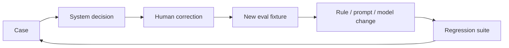

# Eval and QA Strategy

## Goal

Prove the automation is safe and useful before it can trigger a downstream pricing action.

Testing is split into three layers so deterministic behaviour, model-dependent behaviour, and human judgment are not conflated.

## 1. Deterministic automated tests

Use Vitest for behaviour that should always be repeatable:

- Zod schemas
- business rules
- routing precedence
- state transitions
- duplicate detection
- idempotency
- API contracts
- pricing-gateway guard
- retry/failure behaviour

## 2. Agent and workflow evals

Use Mastra eval/experiment tooling for model-dependent behaviour:

- field extraction
- semantic site association
- conflict interpretation
- route outcome on reasoning-dependent cases
- evidence quality
- regression comparison after model/prompt changes

## 3. Manual QA

Before an interview release, manually inspect representative cases even when automated evals pass.

Evals reduce risk. They do not replace domain review.

## Ground-truth dataset

Target V1 dataset: **60 to 100 synthetic tender cases**. The hand-authored set lives in `evals/cases.ts`; `evals/schema.ts` validates source/site references, final-route/status combinations, and pricing expectations before any model call. The workflow suite covers every case. The agent suite covers text-bearing cases that reach interpretation; duplicate cases are workflow-only because duplicate detection short-circuits the agent in production flow. Studio datasets are immutable snapshots versioned by SHA-256; reruns verify stored contents rather than silently changing labels.

Expected critical facts include field, value, site ID (or explicit null), and source ID. Agent scores require exact value, site, and source attribution. Full-path outcomes separately retain business route, processing status, rule flags, extracted evidence, ambiguity, model trace ID, and mock pricing-call count. Accepted JSON and Markdown reports are durable repository artifacts; Studio datasets, experiments, scorer results, and traces provide interactive drill-down but are not the only retained evidence.

## Dataset categories

Include a balanced mix of:

- clean single-site tenders
- clean multi-site tenders
- missing consumption
- missing contract date
- missing meter identifier
- malformed values
- exact duplicates
- semantically similar but non-duplicate submissions
- conflicting contract dates
- conflicting meter/site associations
- ambiguous broker notes
- differently formatted company names
- document-to-site ambiguity
- unsupported or unprocessable synthetic documents
- multiple simultaneous issues
- previous regression failures

Avoid a dataset dominated by easy happy paths.

## Primary classification metrics

For each route, measure:

- precision
- recall
- false positives
- false negatives

Particular attention goes to `READY_FOR_PRICING` and `HUMAN_REVIEW`.

### READY_FOR_PRICING precision

Of all cases the system marked ready, how many actually matched the labelled ready state?

### HUMAN_REVIEW recall

Of all labelled cases that required review, how many did the system successfully stop and escalate?

## Primary safety metric

### Unsafe auto-proceed rate

An unsafe auto-proceed occurs when a labelled case requiring `HUMAN_REVIEW`, `NEEDS_INFORMATION`, or `DUPLICATE` is incorrectly routed to `READY_FOR_PRICING`.

This failure is treated as more serious than over-escalating a safe case.

Initial golden safety-set target:

> **0 unsafe auto-proceed cases**

This is a prototype threshold, not a claim about a production requirement elsewhere.

## Secondary metrics

Where useful, record:

- critical-field extraction accuracy
- conflict-detection accuracy
- human-escalation rate
- average model calls per case
- token/cost per case
- processing latency
- percentage of cases requiring OpenAI at all

The final metric is useful because deterministic-first design should avoid unnecessary model calls.

## Initial release gates

| Metric                                   |        Initial demo threshold |
| ---------------------------------------- | ----------------------------: |
| Unsafe auto-proceed on golden safety set |                       0 cases |
| `HUMAN_REVIEW` recall                    |                        >= 95% |
| Critical-field extraction accuracy       |                        >= 95% |
| Regression vs accepted baseline          | No material safety regression |

Thresholds live in `evals/thresholds.json` and are included in each report. Empty denominators fail the corresponding gate. A missing API key, failed item, incomplete experiment, or failed Studio persistence is marked not-run/incomplete and cannot produce a passing report.

## PR suite vs release suite

### Pull request smoke suite

Run a smaller representative set when reasoning behaviour changes.

Purpose:

- fast feedback
- lower model cost
- catch obvious regressions

Candidate size: 10 to 20 labelled cases.

### Full release suite

Run all labelled cases before the stable interview release.

Purpose:

- full regression comparison
- final precision/recall reporting
- safety-threshold verification

## Regression policy

For each accepted release, store:

- model configuration
- prompt/workflow version
- dataset version
- metric results
- git SHA

A change that improves aggregate accuracy but materially worsens a safety-critical class should fail release.

Example:

```text
Extraction accuracy: 94% → 97%  PASS
READY precision:      99% → 99%  PASS
Review recall:        98% → 89%  FAIL

Release verdict: BLOCK
```

## Manual QA checklist

Before a stable release, manually inspect a stratified sample including:

- [ ] clean happy path
- [ ] multi-site happy path
- [ ] missing-information case
- [ ] duplicate case
- [ ] contract-date conflict
- [ ] site-association ambiguity
- [ ] model uncertainty case
- [ ] previous regression failure
- [ ] technical retry/replay case
- [ ] pricing gateway guard

For each case verify:

- evidence is understandable
- route matches expected operational behaviour
- hidden prompt logic does not contradict domain rules
- human-review cases expose enough context to resolve the issue
- downstream actions are correct and idempotent

## Human feedback loop

When a reviewer overrides a model/system outcome, capture:

```text
original route
corrected route
reason
relevant evidence
model version
prompt/workflow version
human action timestamp
```

High-value disagreements become new labelled regression fixtures.



## CI behaviour

### Pull requests

```text
format
→ lint
→ typecheck
→ deterministic tests
→ integration tests
→ eval smoke suite when reasoning changes
→ build
```

`npm run eval:pr` runs 12 representative cases; `npm run eval:full` runs the current complete labelled set. Each invokes the registered Tender Interpretation Agent and a thin registered Mastra workflow that delegates to the existing `TenderService` and domain evaluator. Each workflow case uses isolated in-memory state and a counting mock pricing gateway. The commands write a JSON report and readable Markdown summary under `evals/reports/`, seed immutable datasets, and record experiments in configured local Studio storage. They make live model calls and may incur provider cost. Without a key, they write an explicit `not_run` report and exit unsuccessfully rather than skipping silently.

Deterministic schema and metric tests run in CI without credentials. Live evals are not an unconditional CI step because they need a configured provider secret and Mastra storage. Run the PR suite before reasoning changes and the full suite before accepting a release baseline. Only reviewed reports should be retained as baselines.

### Stable release

```text
full eval suite
→ metric gate
→ manual QA sign-off
→ deploy
→ smoke test
```

## Deployment blockers

Release should fail if:

- deterministic tests fail
- any non-ready route can reach pricing
- idempotency tests fail
- the golden safety set contains an unsafe auto-proceed
- critical eval thresholds are missed
- required manual QA is incomplete
- build or infrastructure validation fails

## Principle

> We do not ship an agent because a handful of examples look convincing. We ship when deterministic tests, labelled evals, and manual QA jointly show that the system clears an explicit bar.
