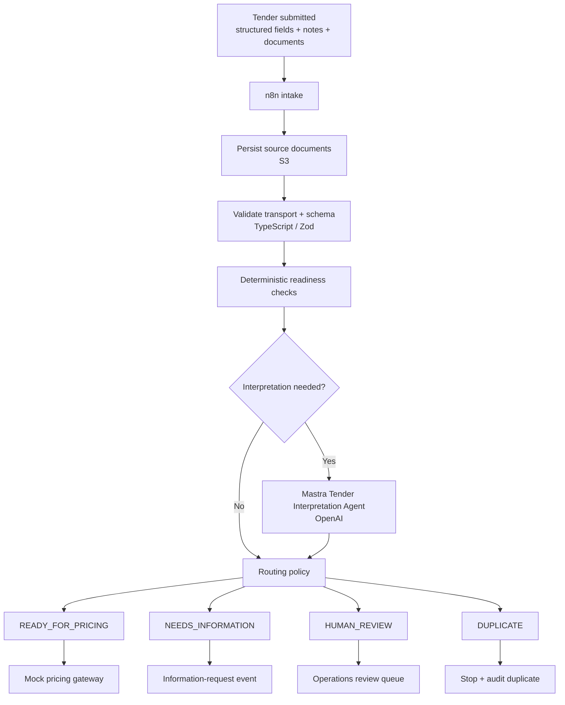

# Process Map and Automation Boundary

## Purpose

Make the end-to-end flow and automation boundary explicit: what is deterministic, what uses OpenAI, what requires a human, and where the system stops before downstream pricing.

## End-to-end flow



## Deterministic work

The following should be solved without an LLM where possible:

- schema validation
- required-field presence
- numeric bounds such as consumption > 0
- date parsing and normalization
- exact duplicate checks
- known identifier formatting
- routing precedence
- idempotency
- retry policy
- permission to call the pricing gateway

## AI-assisted work

OpenAI is used only for bounded semantic interpretation, for example:

- extracting a contract date from unstructured text,
- associating a broker note with the correct site,
- identifying that differently formatted company names may refer to the same entity,
- explaining why two sources appear to conflict,
- returning evidence-backed structured facts from ambiguous text.

The agent returns evidence and structured facts. It does not own final routing policy.

## Human-only boundary

A human should receive the case when:

- critical sources conflict and no deterministic source-of-truth rule exists,
- evidence cannot be associated with the correct site reliably,
- a critical extraction fails the agreed safety policy,
- a required document cannot be processed safely,
- policy requires accountable human approval,
- a human override is explicitly requested.

## Example paths

### Clean tender

```text
Tender received
→ schema valid
→ required fields present
→ dates parse
→ no duplicate
→ evidence consistent
→ READY_FOR_PRICING
→ pricing gateway called once
```

### Missing information

```text
Tender received
→ annual consumption missing
→ TDR-004 fails
→ NEEDS_INFORMATION
→ no OpenAI call required
→ no pricing handoff
→ information-request event emitted
```

### Semantic conflict

```text
Tender form: contract end = 31/03/2027
Supporting contract: contract end = 30/09/2026
→ OpenAI extracts structured facts + evidence where needed
→ deterministic conflict rule compares normalized values
→ HUMAN_REVIEW
→ pricing blocked
```

### Technical failure after readiness

```text
READY_FOR_PRICING
→ pricing gateway request
→ downstream HTTP 500
→ retry according to policy
→ still failing
→ processing status = FAILED
→ business route remains READY_FOR_PRICING
→ replay must not create duplicate downstream action
```

## Constraints

- `FAILED` is a technical status, not a business route.
- OpenAI never writes directly to pricing.
- `READY_FOR_PRICING` requires explicit evidence and passing safety checks.
- Critical ambiguity is never silently resolved by confidence score alone.
- n8n orchestrates integrations but does not own domain rules.
- Human corrections are recorded and can become regression cases.

## Downstream boundary

```text
Tender Readiness Engine
        ↓
READY_FOR_PRICING
        ↓
Mock pricing gateway
        ↓
[real pricing / transaction infrastructure outside prototype scope]
```
